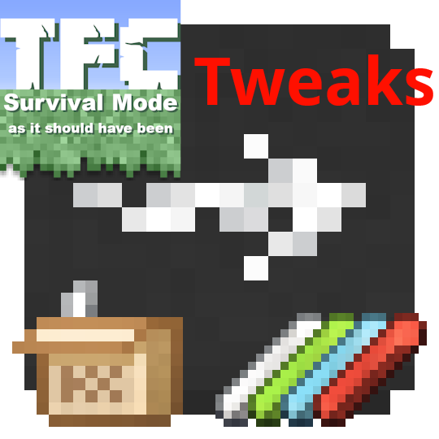

# TFC-Chalkworks-Barrel-Edition-Tweaks

This is a companion datapack to [TFC Chalkworks: Barrel Edition](https://github.com/Quizer9O8/TFC-Chalkworks-Barrel-Edition).

### Requirements:
* [TerraFirmaCraft](https://modrinth.com/mod/terrafirmacraft)
* [Chalk](https://modrinth.com/mod/chalk-mod)
* [TFC Chalkworks: Barrel Edition](https://github.com/Quizer9O8/TFC-Chalkworks-Barrel-Edition)

# Core features
* Removes the vanilla chalk recipes for all 16 colors, cleaning up the recipe overview. There recipes would never have been used anyway in TFC.

* Changes the Chalk Box recipe to use glue instead of a slimeball.

# Links
- [Download on CurseForge](https://legacy.curseforge.com/minecraft/data-packs/tfc-chalkworks-barrel-edition-tweaks)
- [Download on modrinth](https://modrinth.com/datapack/tfc-chalkworks-barrel-edition-tweaks)